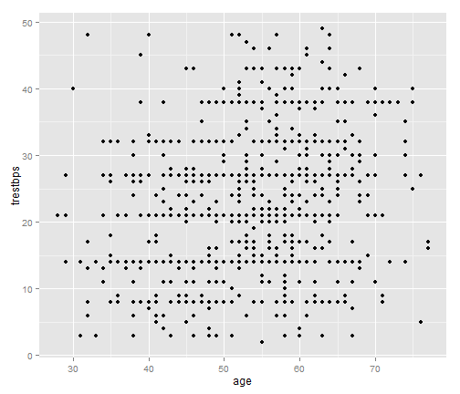

Heart Disease Data
========================================================


```r
data <- read.csv("HeartDataAll.csv")
data <- data[-1]
data[data == "?"] <- NA  # changes intances of ? to NA
table(complete.cases(data))  # only 63 rows without missing data
```

```
## 
## FALSE  TRUE 
##   858    63
```

```r
data1 <- data[, c(1, 2, 3, 4, 5, 15)]  #subset of rows we might use
data1[, 5][data[, 5] == "0"] <- NA  #a lot of the cholestreol meaurements is 0, which is impossible
table(complete.cases(data1), data[, 15])  # now there are no cholestrol measurements for switz
```

```
##        
##         Cleveland Hungary Switzerland  VA
##   FALSE       152     158         123  98
##   TRUE        151     137           0 102
```

```r
data1[, 4] <- as.numeric(data1[, 4])  # change the resting BP to numeric
summary(lm(trestbps ~ age + place, data = data1))  #actually a fairly good p-value here for age
```

```
## 
## Call:
## lm(formula = trestbps ~ age + place, data = data1)
## 
## Residuals:
##    Min     1Q Median     3Q    Max 
## -23.15  -7.66  -0.61   6.78  32.23 
## 
## Coefficients:
##                  Estimate Std. Error t value Pr(>|t|)    
## (Intercept)        4.7729     2.2808    2.09   0.0367 *  
## age                0.3057     0.0404    7.57    1e-13 ***
## placeHungary       2.5150     0.8666    2.90   0.0038 ** 
## placeSwitzerland   1.2177     1.0713    1.14   0.2560    
## placeVA            0.1458     1.0267    0.14   0.8871    
## ---
## Signif. codes:  0 '***' 0.001 '**' 0.01 '*' 0.05 '.' 0.1 ' ' 1
## 
## Residual standard error: 9.87 on 835 degrees of freedom
##   (81 observations deleted due to missingness)
## Multiple R-squared:  0.0678,	Adjusted R-squared:  0.0633 
## F-statistic: 15.2 on 4 and 835 DF,  p-value: 5.54e-12
```


You can also embed plots, for example:


```r
library(ggplot2)
qplot(age, trestbps, data = data1)  #ugh
```

```
## Warning: Removed 81 rows containing missing values (geom_point).
```

 

all in all i think we should go with the tried and tested F-Ham Heart Study
